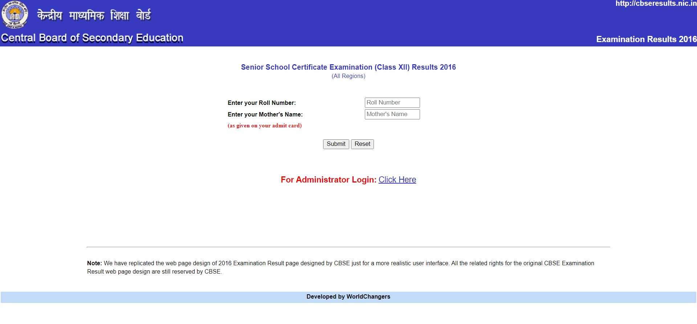
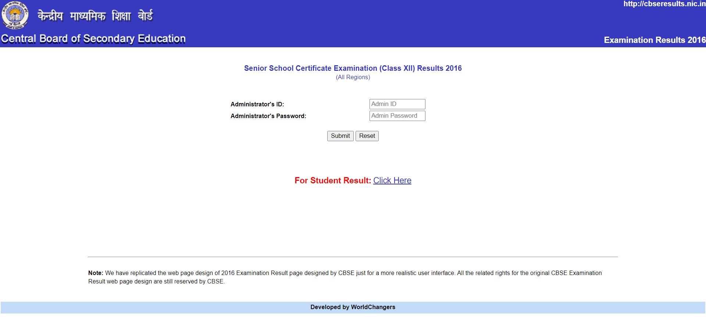
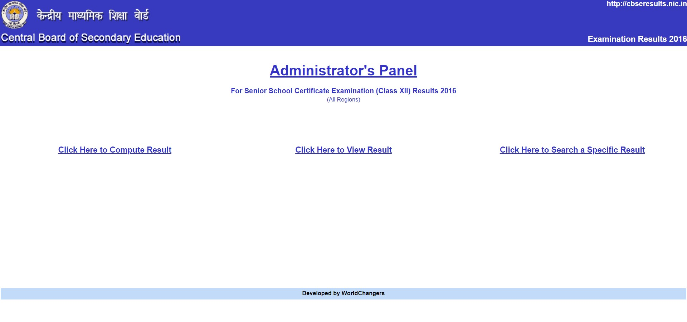
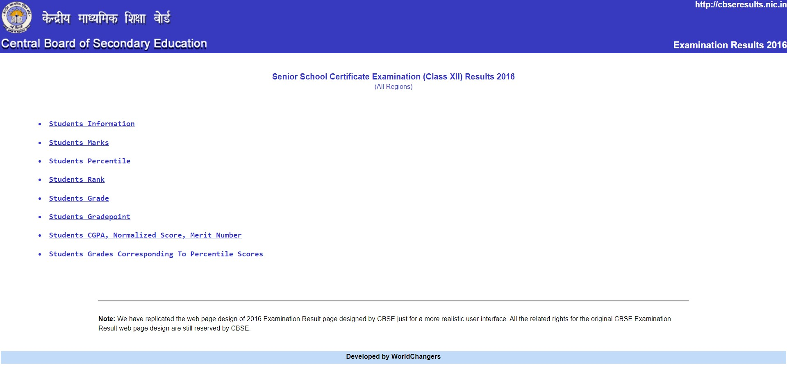
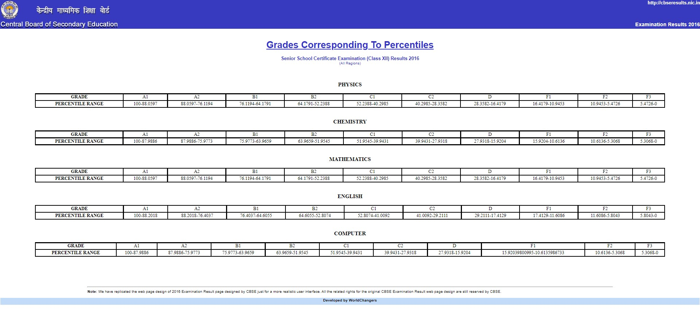
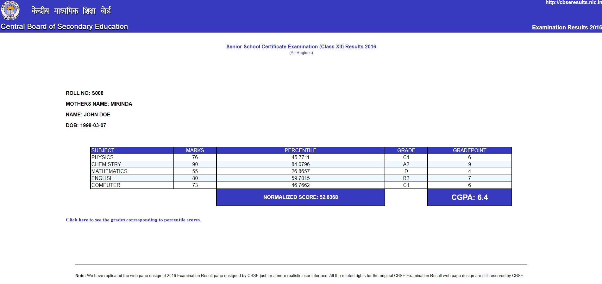

# SIH 2017 Standardization of Marks
 This project is based on the problem statement provided by the Minstry of HRD (India) for Smart India Hackathon '17. As per the given problem statement, we need to solve the problem of bunching of marks at certain levels and problem of high scorers being at disadvantageous position due to lower competitive percentile.
 
 In this project, we implement our proposed algorithm for standardization of marks, and try to do so in a user interface that looks very similar to the CBSE's actual result interface.
 
 More information on the problem statement and our proposed method for solving it can be found [here](./Hackathon-PDF.pdf). We use a fictional SQL dataset (student_dataset.sql) to demonstrate the working of our algorithm.
 
 # Setting up the project
  - **Step 1:** Install XAMPP from https://www.apachefriends.org/.
  - **Step 2:** Copy the contents of folder "World Changers" from this repo to the htdocs folder at location "(drive_letter_where_xampp_is_installed):\xampp\htdocs\". Note that you might need to overright the already existing "index.php" in the htdocs folder.
  - **Step 3:** Open the XAMPP Control Panel and start both "Apache" and "MySQL" modules.
  - **Step 4:** Click on the "Admin" button for the "Apache" module for the localhost to start on the default internet browser (You can do the same by opening any internet browser and visiting "localhost/" instead).
  - **Step 5:** Click on the "Admin" button for the "MySQL" module for the MySQL server (phpMyAdmin interface) to start on the default internet browser.
  - **Step 6:** Using the phpMyAdmin interface, create a new database with name "student_database" and insert a new empty table also with the same name "student_database". The new table should be created with 34 columns.
  - **Step 7:** Visit "[localhost/AdminLogin.php](http://localhost/AdminLogin.php)" and enter Admin Id and Admin Password as "PCCOE" and "NIGDI" respectively.
  - **Step 8:** Once you redirect to the Admin portal after logging in, click on the "Click Here to Compute Result" button.
  - **Step 9:** This should display a message saying "The result has been computed".
  
  This finally completes the setting up of the project for you to explore and play around with it. Thank You!
  
  # Technologies Used
  - PHP
  - MySQL
  - HTML
  - XAMPP Control Panel
  
  # Some Snapshots
  
  
  
  
  
  
  

  # Project Members
  - [Saransh Dave](https://www.linkedin.com/in/saransh-dave/)
  - [Saurabh Purkar](https://www.linkedin.com/in/saurabh-purkar/)
  - [Akash Dhaytadak](https://www.linkedin.com/in/akash-dhaytadak-0a74bb12a/)
  - [Shubham Dodmise](https://www.linkedin.com/in/shubham-dodmise/)
  - [Rushikesh Borse](https://www.linkedin.com/in/rushikeshborse/)
  - [Akash Musale](https://www.linkedin.com/in/algorhythmic/)
